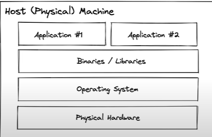
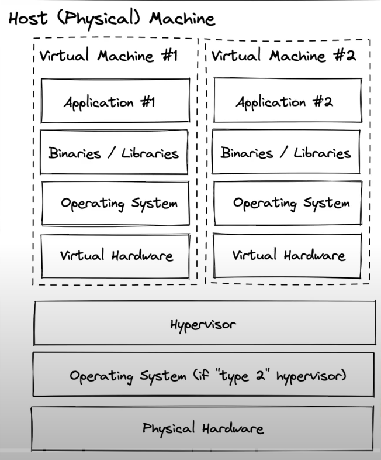

# Docker

## Evolution

It works on my machine, okay then we will ship to your machine too.

### Container

A docker container image is a lightweight, standalone, executable package of software that includes everything needed to run an application.

### Open Container Initiative (OCI):

The open container initiative is an open source governance structure for the express purpose of creating open industry standards around container formats and runtimes.

- runtime specification
- image specification
- container specification

### Evolution of virtualization

#### Bare Metal:

- Hellish dependency conflicts.
- low budget efficiency.
- large blast radius.
- slow start up & shut down speed(minutes).
- very slow provisioning & decommissioning (hours to days).

#### Virtual Machine

Hypervisor:

- Two types of hypervisors:
  Type 1: Hardware Virtualization - No underline os.
  Type 2: Software Virtualization - virtual box to run virtual machine.

- No dependency conflicts.
- Better utilization efficiency.
- small blast radius.
- fast start up & shut down speed(minutes).
- fast provisioning & decommissioning (minutes).
