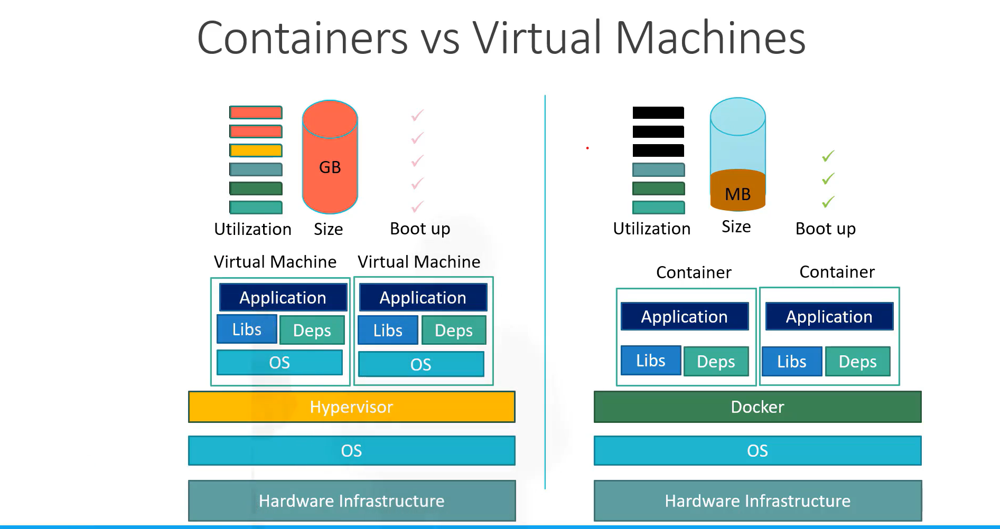

# CKA -

## Docker-Fundamental-Overview

### Containers:

Containers are completely isolated environments, as in they can have their own processes or services, their own networking interfaces, their own mounts just like virtual machines.
They all will share the same operating system kernel.

LXC, LXD, LXCFS - containers

The main purpose of the docker is to containerize the application and to ship them and run them.
docker is a platform whose main step is to build ship and run the container.

### Virtual machines vs Containers:

Docker has less isolation as compared to vm they have complete isolation.

### Container vs Image:

An image is a package or a template just like a VM Template. It is used to create one or more containers. Containers are running instances of images that are isolated and have their own environments and set of processes.

### Container Orchestration

Kubernetes is just a container orchestration technology . Docker has its own tool called Docker Swarm.
Kubernetes from google and MesOs from apache.

### Kubernetes Architecture -

- refer for diagram: https://github.com/piyushsachdeva/CKA-2024/blob/main/Resources/Day05/readme.md
- **Kubectl:** It is a type of client that helps to interact with the cluster and its components.
- **Node:** Node is nothing but a virtual machine on which we run our components or workloads is considered as node in kubernetes.
- **Control plane/Master Node:** Is a virtual machine or master node that hosts many administrative components. These components having their own specific purpose and they helps us to run clusters smoothly.
  - In high availability or in production environments we usually have more than one node for a production environment as well to support high availability.
- **Control Plane Components:**
  - **APIServer:** Api Server is the center of the control plane i.e. any incoming request from client will first reach to the APIServer and then APIServer will interact with other components on its behalf.
  - **Scheduler:** It will help us to schedule the workload. It receives the request from the APIServer and it finds the suitable nodes for scheduler pods.
  - **Controller Manager:** It is a combination of many different controllers. So we have node controllers, namespace controllers, deployment controllers etc. It makes sure that all the containers are running fine and everything is monitored. If suppose the pod goes down it  
    will monitor the pod and keep restarting the pod.
  - **etcd:** It is a key value data store. It store the information of cluster nodes, pods, cluster details etc. Every api server will interact with etcd database.
- **Worker Node:** In worker node we have the actual running/work happening in the cluster.
  - **Kubelet:** It receives the instructions from the control plane node. lets suppose we want to delete the pod so we will instruct the api server and it will go to kubelet that will make the changes and delete the pod. and it will inform the APIServer that the pod has been deleted and then APIServer will make the changes in the etcd database. It is a node based agent that works as a communication between worker node and control plane node.
  - **Kube-Proxy:** It helps in enabling the networking within the node. It allows the pod to communicate with each other. It creates some ip tables route.
- **Pod:** It encapsulates a container/ one or more container in its own so that those containers share the resources of the pod. We can have one or more container these can be helping containers/ monitoring agents.

**what kubectl do to connect with APIServer:**
Authenticate -> authenticate -> create a pod (kubectl create pod) -> etcd (it will not create a pod as it is a database it will just create entry in the etcd database) -> scheduler (this will monitor the pod and once it will find it will schedule the node) -> api-server(scheduler will notify to the api server that scheduler found a node go ahead and schedule the pod on this node) -> schedule the pod -> api-server reach put to kubelet and it will add in etcd database.

### process ->

authenticate
validate
retrieve
update in etcd from scheduler
send -> kubelet
response -> api-server -> client

## Kind Cluster(Kubernetes In Docker)

It is a tool to run local kubernetes clusters using Docker Containers.

### Kubernetes Multi Node Cluster ->

Creating a kubernetes cluster is as simple as kind create cluster. (make sure kubectl is installed - kubectl version --client)

- kind create cluster --image (image_name) --name cka-cluster
- kubectl cluster-info --context kind-cka-cluster1
- kubectl get nodes
- multi-node cluster:
  - ex - config.yaml:
    kind: Cluster
    apiVersion: kind.x-k8s.io/v1alpha4
    nodes:
    role: control-plane
    role: worker
    role: worker
